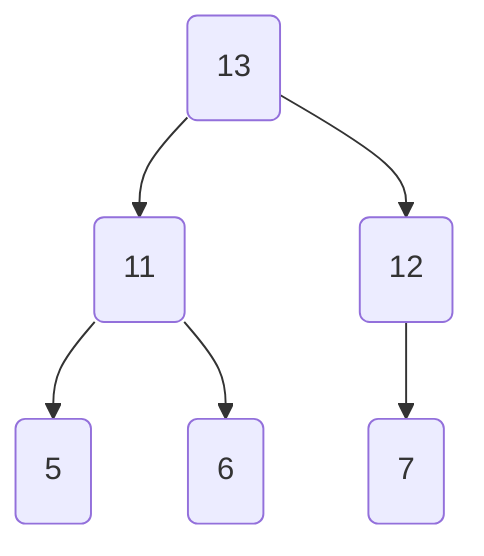

## 堆的概念
- 堆是一个**完全二叉树**，所谓的完全二叉树，就是除了最下面一层的节点，其他节点都必须排满，最下面一层的只能从左到右排
- 堆可以用**层级表示法**表示成一个数组结构，且数据中没有null元素。
- 如果堆中的一个元素的数组下标是`i` , 那么，其子元素的数组小标分别是 `2*i + 1`,` 2*i + 2`
- 堆分成 **大根堆** 和 **小根堆**。 所谓大根堆，是每个父节点比他的任意一个子节点要大。
- 堆的结构维持靠两种操作，**上浮**和**下沉**
- **优先队列**，弹出最小元素，这个可以使用堆数据结构来实现。

## 堆排序代码go-through
* #### 构造一个大根堆。从叶子节点开始，逐个的检查元素，是否符合堆的特点（根元素最大）
``` python
def heapSort(arr):
    n = len(arr)

    # 构造大根堆，（max heap），只需要遍历下有子节点的节点，进行上浮。
    for i in range(n // 2 - 1, -1, -1):
        heapify(arr, n, i)

    ## 检查完毕后，数组按照堆的排列如下图一所示。

    #  接着将根元素（也就是最大值）和最后的一个元素进行调换，然后对堆顶的元素进行下沉。
    for i in range(n - 1, 0, -1):
        arr[i], arr[0] = arr[0], arr[i]
        heapify(arr, i, 0)
        
```
    
* #### 图一




```python
# n代表数组中需要处理的长度 ， i代表需要操纵的元素，
# 如果是0，代表的是堆顶的元素，需要下沉。
# 如果是 i，代表是堆末有叶子的元素，需要上浮。
def heapify(arr, n, i): 
    largest = i  
    l = 2 * i + 1     # left = 2*i + 1 
    r = 2 * i + 2     # right = 2*i + 2 
  
    if l < n and arr[i] < arr[l]: 
        largest = l 
  
    if r < n and arr[largest] < arr[r]: 
        largest = r 
  
    if largest != i: 
        arr[i],arr[largest] = arr[largest],arr[i]  # 交换
  
        heapify(arr, n, largest) 
```
